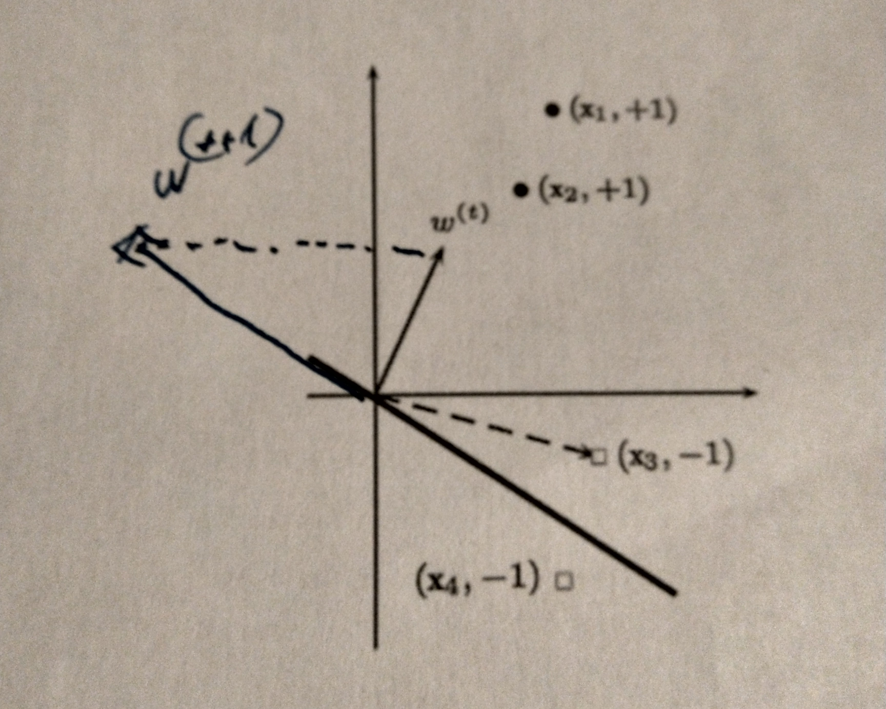

# Analysis of Perceptron Algorithm

#### Vu-Lam DANG - MOSIG Data Science
## Algorithm

The perceptron algorithm is one of the first supervised models proposed *(Rosenblatt, 1957)* . The algorithm is trained by finding the parameters of a linear function defined by

\begin{align}
    h_w : \mathbb{R}^d &\mathbb{\rightarrow} \mathbb{R}\\    x &\mapsto \langle w, x \rangle
\end{align}

using a training set $S=((x_i,y_i))^m_{i=1}$ of size m where, $\langle .,.\rangle$ denotes the dot product and the classes verify $\forall i \in \{1,...,m\}, y_i \in \{-1,+1\}$. The training of the model is done on-line following the perceptron update algorithm.41 mins ·

1. The algorithm randomly select a datapoint $(x_i, y_i)$ and check with the current model ($w^t$) if the model correctly predict the outcome ($y_i$). $y \cdot (w \cdot x) = 1$ iff $y = (w \cdot x)$. Indeed, if $y=1$, $y \cdot (w \cdot x) = 1$ if and only if  $w \cdot x = 1$ too, and vise versa for $y=-1$. Otherwise, $y \cdot (w \cdot x) = -1$.

1. When a datapoint is found to disagree with the model, the model is updated by
    $$
    w^{(t+1)} = w^{(t)} + \epsilon \times y \times x
    $$ 
    where $\epsilon$ is the learning rate; $0\le\epsilon\le 1$. This mean that the weight is modified by a scalar of $y\times x$.
    
    $y\times x$ is a scalar product of x itself. As $y\in \{-1,+1\}$, this essentially meant that depend on the intended outcome, the model should be the align or opposite to the direction of $\vec x$.

1. According to fig. 1, $w^t \cdot x_3 > 0$; however $y_3 = -1$. Therefore, $w^{(t+1)}$ is updated as:

    \begin{align*}
w^{(t+1)} &= w^t + \epsilon \times y \times x \\
          &= w^t - x_3
\end{align*}

    

1. $(y_i\times (w*,x_i))>0$ mean the dot product of $w*$ and $x_i$ correctly predict the class of the output $y_i$.

1. Since $\frac{w}{||w||}$ is a scalar product of *w* (also know as normalization), the product $y_i \times \langle \frac{w}{||w||}, x_i \rangle > 0$ for all $i$ (since $\forall i, y_i \times \langle w, x_i \rangle > 0$). Therefore $min_{i \in [1,..,m]}(y_i \times \langle \frac{w}{||w||}, x_i \rangle)$ is strickly positive.