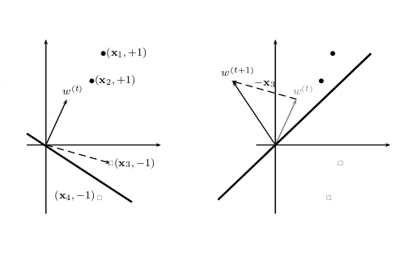

# Class Notes: Fundamental Machine Learning [^2]
[Homework 1](http://ama.liglab.fr/~amini/Cours/ML/ExamMOSIG-ML-2013-2014.pdf) [^1]
## ERM principle

- Given a training set $S = (x, y)^m_{i=0}$ and a class of function $F$
- Emperical Risk Minimization principle:

    Find $f$ by minimizing the unbiased estimator of its generalization error $L(f)$ on a given training set:

    $$
    \hat{L}(f,S) = \frac 1 m \sum_{i=1}^m l(f(x_i)y_i)
    $$
- Problem: for a finite set S, $\hat{L}(f,S)$ come to 0; however, for infinite set, error always equal 1.

## Quantitative Learning Model

- $1^{st}$ learning model: biological neuron ($19^{st}$ century).
- MuCilloch & Pitts formal neuron (1943)
    - Linear prediction function.
- Rosenblatt's Perceptron
    - The equation  
    $$\sum_{y=1}^d w_jx_y + w_0 = 0$$
    represent an hyperplane in the vector space of dimension $d$
    - Aim of learning when we are doing classification is to find weight $(w_1, w_2, ...)$ in order to have a positive response for examples of class +1 and negative response for examples of class -1.
    - Any vector x in the vectoral space has a unique decomposition $\vec x = \vec{x_p} + \vec{x_H}$
    $$
    \vec{W_N} \cdot \vec x = \sum_{j=1}^d w_j x_j = \vec {w_N} \cdot (\vec {x_p} + \vec {x_H} ) = (\vec {w_N} \cdot \vec {x_p} ) + (\vec {w_N} \cdot \vec {x_H} )
    $$
    - The idea of Rosenblatt:

        >There are 2 types of signals that are drawn on the perceptron board. Signals correspoding to the form of interest, to which are associated the out put +1, and the other signal assoc. the output -1.
        
        >Find the weights of the hyperplane by minimizing the distance between the classified signals on the hyperplanes.

    - Learning perceptronparameters
        - Objective function:
        $$
        \hat L (w) = - \sum _{i' \in I} y_{i'} ((\bar w, x_{i'})+ w_0)
        $$
        - Update rule: gradient descent
        $$
        \forall t \ge 1, w^{(t)} \leftarrow w^{(t-1)} - \eta \nabla_{w^{(t-1)}}\hat L(w^{(t-1)})
        $$
        - Derivatives with respect to the parameters
        $$
        \frac {\delta \hat L (w)}{\delta x_0} = - \sum_{i' \in I} y_{i'}
        $$
        $$
        \Delta \hat L (\bar w) ) - \sum _{i' \in I} y_{i'}X_{i'}
        $$
        - Stochastic gradient descent
        $$
        \forall (X,y), if y ((\bar w, X)+w_0) \le 0\ then \begin{pmatrix} w_0\\ \bar w \end{pmatrix} \leftarrow \begin{pmatrix} w_0\\ \bar w \end{pmatrix} + \eta \begin{pmatrix} y\\ yX \end{pmatrix}
        $$

    - Graphical depiction of online update rule
    

[^1]: email to: Massih-Reza.Amini@imag.fr 
[^2]: Slides can be found [here](http://ama.liglab.fr/~amini/Cours/ML/MLF-MRA-1.pdf)