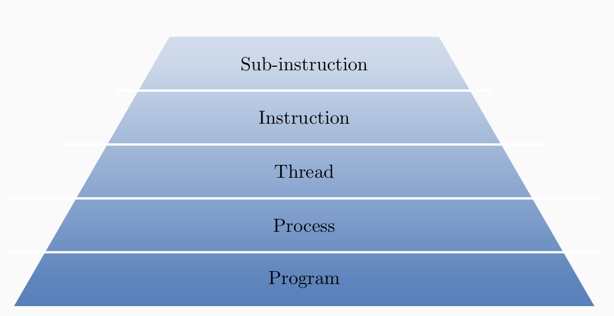
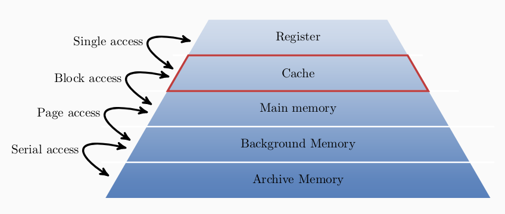
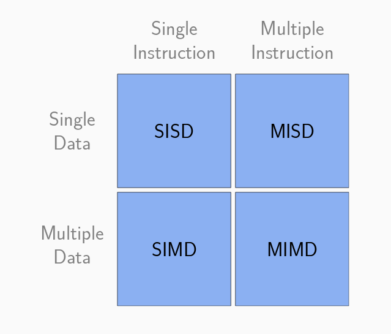

# High Performance Computing and Modeling [^1]

[Christophe Picad](mailto:christophe.picad@imag.fr)

## Chapter 1: A first take on parallelism

1. Context
    - Decrease time to solution
    - Larger problems
    - Combine resources of several processing units
    - Harness the processing power of modern architectures
    - Utilizing idle processing power (SETI@home)
    - Improve the precision of computations in a limited time (Weather forecast, etc)

2. Course content
    - Project

3. Introduction
    - Examples
        - Legoland (Raspberry Pi)
        - Curie Supercomputer
    - Motivation
        - Sequential data is limited
            - Parallel applications
            - Limited access to memory
        - Performance
        - Intensive Computation
    - Limitation of sequential computing
1. Parallel platform
    1. Parallel hierarchy
    
    1. Memory hierarchy
    
    1. Flynn classification
    
1. Parallel computational unit
    - Implicit parallelism
        - Parallel execution of different processor instructions
        - Happen almost automatically
        - Can only influenced indirectly by the programmer
    - Multi core
        - Commodity hardware
        - Shared memory
    - Cluster
        - Aggregation of compute unit
        - Independent systems linked using fast interconnect
        - Each system has its own memory
1. Memory models
    1. Shared memory
        - All processors share the same memory space. They're communicate using reading and writing to global shared variables.
        - Each processing unit carry out its task independently but modification of shared variables are instantaneous.
        - 2 kinds of shared memories:
            - SMP: Symmertric Memory
            - NUMA: NonUniform Memory Access - all proessor can access to the memory but not uniformly. Each has a preferred access to some memory part
                - Decrease bottleneck risk
                - Local memory cache on each processor to mitigate the effect of non-uniform access
    1. Distributed memory
        - Each processor has its own memory. There are no global memory space
        - Each processor commuicate with  the others using messages
            - Modification of vairables are local and only the processor managing the memory can access it.
            - Each processor work independently on its own set of variables
            - The speed of the resolution depends on the architecture
            - Can be scaled easily
1. Software
1. Foster method
    1. Choice criterion
    1. Dependency design space
[^1]: [cours website](https://chamilo.grenoble-inp.fr/courses/ENSIMAGWMM9MO16/index.php?id_session=0)