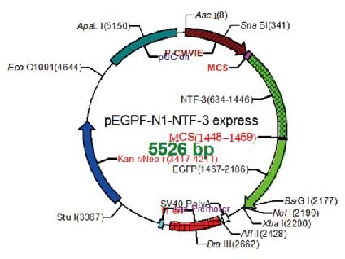
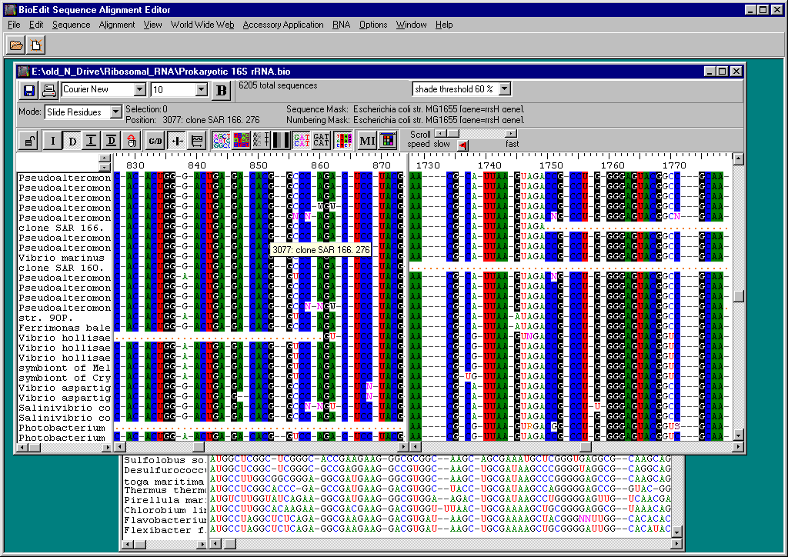

# Proposal for scientific software: PySeqView (tentative)

We are looking for a Bachelor student to work on a possible software for sequence editing and visualization software. This topic should constitute a Bachelor thesis. I will be the direct supervisor, with Professor Rahmann advise.

***Supervisor:*** Vu-Lam Dang.

***Abstract:*** Sequence management, alignment editing and figure generation is an important task performed daily by biologists. One of the most widely used tools in use for such tasks is BioEdit [^1]. However, BioEdit is no longer being maintained, and thus we propose the creation of a new open-source software package that aims to replace BioEdit.

## Background

BioEdit [^1] is a popular biological sequence alignment editor written originally for Windows 95/98/NT/2000/XP. It has a multiple document interface with convenient features that makes the alignment and manipulation of sequences relatively easy on a desktop computer. Several sequence manipulation and analysis options and links to external analysis programs facilitate a working environment that allows the user to view and manipulate sequences with simple point-and-click operations. It also has the capability to generate figures useful for scientific publications.

Figure: Example of figure generated by BioEdit. Source[^2]

Although BioEdit is a very popular program, and still widely used as of 2021, its development had been stopped since 2007. It has an outdated graphical user interface and is likely to contain unresolved bugs and security compromises. The figures generated by BioEdit are also outdated compared to contemporary standards. Furthermore, the software is only provided for Windows operating system, thus making it more difficult to run on Mac/Linux environment.

 
Figure: BioEdit Graphical User Interface

Other softwares provide workarounds to generate figures suitable for modern articles. One of them is SnapGene Viewer. However, its free version has some limitations, particularly in editing the sequences, forcing the users to use workarounds such as manually editing the sequence in a text editor. More tech-savvy users employ more advance graphical software like Photoshops or AutoCAD to create figures, but this is hardly ideal.

Finally, as of 2021, the original BioEdit website host at NCSU is no longer available, as its maintainer, Dr James Brown has retired. A mirror website is available at [BioEdit site](https://thalljiscience.github.io/).

## Proposal

The goal of this project is to create a foundation for free open source software (FOSS) that facilitate multiple sequence alignment, manipulation and visualization. The software should also perform a variety of other essential functions relevant to wet lab operation.

Primary functions:
- Alignment Management and Editing
  - Align DNA sequences with a reference sequence
  - Pairwise and multi-sequence DNA and Protein alignment
  - Choice of alignment algorithms - Clustal Omega, MAFFT, MUSCLE, T-Coffee
  - Contig Assembly
- Visualizing
  - See multiple views of a DNA sequence
  - Large sequence support - browse chromosome size sequences
  - Edit DNA and protein sequences
  - Color code sequences
  - Plasmid drawing interface for automated creation of plasmid vector graphic from a DNA sequence

Further functionalities shall be added to make to program comparable to BioEdit.

The developer is recommended to use Python with Tkinter to create the graphical interface, or propose a solution of their own.

## References

[^1]: T. A. Hall, “BioEdit: A User-Friendly Biological Sequence Alignment Editor and Analysis,” 1999. [Website](https://thalljiscience.github.io/)

[^2]: Peng C, Yin X, Li M, He T, Li G. Construction of a eukaryotic expression plasmid for human retina-derived neurotrophin-3. Neural Regen Res 2013;8:1031-40. Available from: [Website](http://www.nrronline.org/text.asp?2013/8/11/1031/121470)