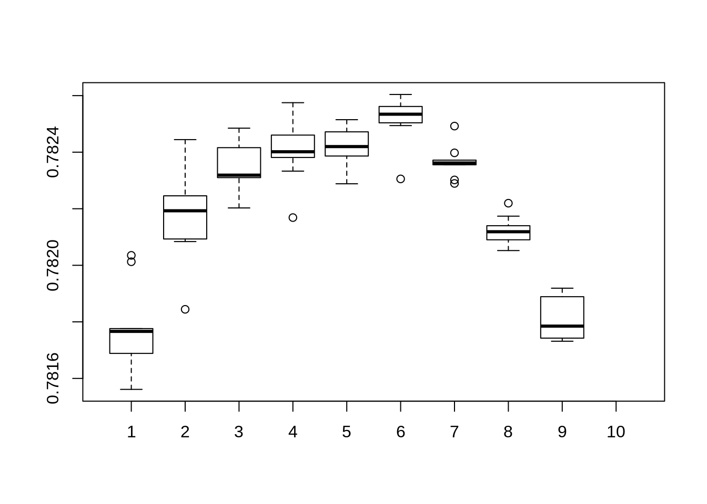
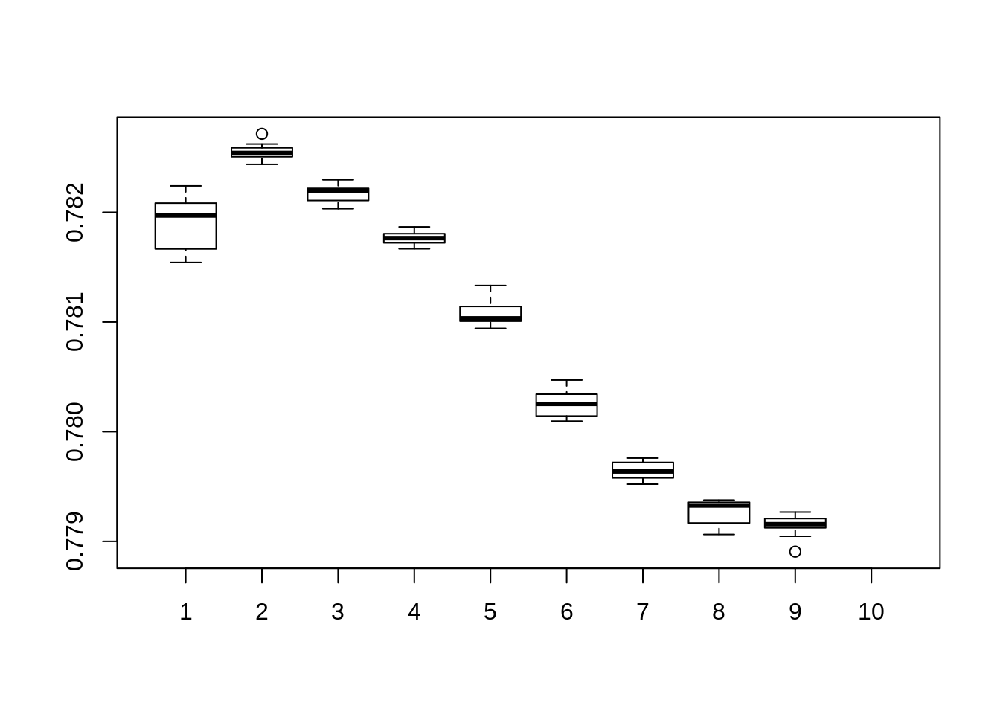
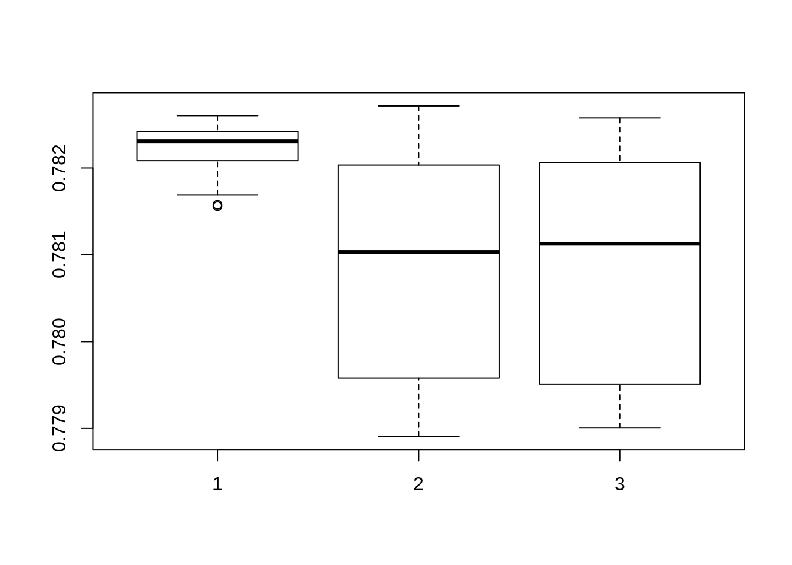
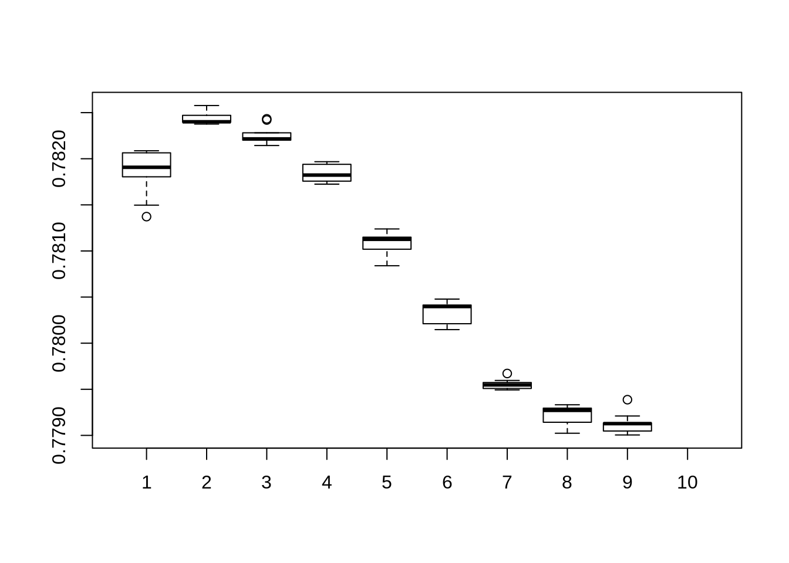
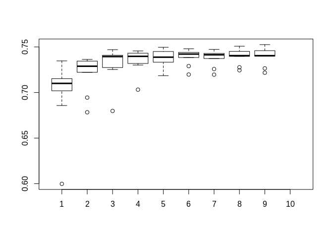

In this document I go in depth into using XGBoost to enhence the performance of C+T by combining multiple C+T predictors. [^1]

## Prequisites

The following packages are required to knit this document:

- bigstatsr
- bigsnpr
- data.table
- xgboost


##Dataset

*Please change working direction in `directory`*

I use the "Simus" simulated dataset provided by Florian. This dataset contain ~650,000 SNPs in 2 chromosomes. 20% of them are cases and the rest 80% are controls.


## C+T step
Generating a matrix of C+T with varied clumping radius and $p-value$ thresholds.

$\beta s$ and $p-values$ are aquired in sumstats file (see `sumstats.txt`)


XGBoost only accept dataframe, so all FBM output must be converted to data frame


## Data treatment: Oversampling

To oversampling I extract all positive (*affection = 1*), and append them a number of times. For this simulated dataset, I enhanced the number of cases 10 times, thus the ratio become ~70:30 (from 20:80).


##XGBoost

XGBoost provide slightly better result compare to SCT. However this result heavily depend on booster and objective selection. Experiments shown that **gblinear** booster with **count:poisson** objective give the best results.

For the first experimentation, I run 9 different *max_depth* and 9 *nrounds* with *count:poisson* objective function. Each combination is repeated 10 times and the mean value calculated to rule out the randomess of *gblinear* booster


```r
poisson_AUCs <- matrix(,nrow = 10, ncol = 10)
for (i in seq(2 : 10)){
  for (j in seq(2: 10)) {
    temp <- c()
    for(t in seq(1:10)){
      bstSparse <- xgboost(data = ds[], 
                           label = y.train, 
                           booster="gblinear",
                           max_depth = i, 
                           eta = 1, 
                           nthread = 2, 
                           nrounds = j, 
                           lambda = 0.1,
                           objective = "count:poisson"
                           )
      pred <- predict(bstSparse, PRS_test[])
      temp <- append(temp,AUC(pred = pred, test$fam$affection))
    }
    poisson_AUCs[i,j] <- mean(temp)
  }
}
```

```
##            [,1]      [,2]      [,3]      [,4]      [,5]      [,6]
##  [1,] 0.7817714 0.7823509 0.7823041 0.7822926 0.7825028 0.7824836
##  [2,] 0.7820513 0.7822373 0.7823633 0.7824287 0.7822630 0.7824896
##  [3,] 0.7814487 0.7821501 0.7823655 0.7826146 0.7825234 0.7825795
##  [4,] 0.7820921 0.7824120 0.7824182 0.7826145 0.7825073 0.7824446
##  [5,] 0.7821936 0.7824070 0.7821748 0.7823153 0.7826239 0.7824142
##  [6,] 0.7819266 0.7822376 0.7822175 0.7824563 0.7823541 0.7824829
##  [7,] 0.7818918 0.7820830 0.7823140 0.7823306 0.7824132 0.7824501
##  [8,] 0.7820375 0.7822164 0.7824588 0.7824749 0.7825382 0.7825095
##  [9,] 0.7822184 0.7819440 0.7825596 0.7823647 0.7824570 0.7823492
## [10,]        NA        NA        NA        NA        NA        NA
##            [,7]      [,8]      [,9] [,10]
##  [1,] 0.7823923 0.7821336 0.7818004    NA
##  [2,] 0.7823814 0.7821682 0.7817430    NA
##  [3,] 0.7823602 0.7821881 0.7817512    NA
##  [4,] 0.7823655 0.7820304 0.7818152    NA
##  [5,] 0.7822578 0.7821342 0.7818768    NA
##  [6,] 0.7824436 0.7822035 0.7817998    NA
##  [7,] 0.7824093 0.7822224 0.7817339    NA
##  [8,] 0.7824048 0.7821033 0.7817913    NA
##  [9,] 0.7823197 0.7822398 0.7817214    NA
## [10,]        NA        NA        NA    NA
```



I omitted the code for the next 2 experiments as they are largely similar, with exception of the option *objective* for *xgboost* function.

For the next experimentation, I run 9 different *max_depth* and 9 *nrounds* with *reg:logistic* objective function. Each combination is repeated 10 times and the mean value calculated to rule out the randomess of *gblinear* booster




For the final experimentation, I run 9 different *max_depth* and 9 *nrounds* with *binary:logicraw* objective function. This function is interesting since it's specific for binary classification.

Here is a composite boxplot comparing different objective functions. Index 1 is *count:poisson*, 2 is *reg:logistic* and 3 is *binary:logistic*





## The effect of Boosters

I replicate the experiment with the *gbtree* booster. Every other aspect stay the same. The effect of *max_depth* and *nrounds* is similar to *random forest*: more depth means more stability, while more rounds might lead to overfitting.

```r
tree_poisson_AUCs <- matrix(,nrow = 10, ncol = 10)
for (i in seq(2 : 10)){
  for (j in seq(2: 10)) {
    temp <- c()
    bstSparse <- xgboost(data = ds[], 
                         label = y.train, 
                         booster="gbtree",
                         max_depth = i, 
                         eta = 1, 
                         nthread = 2, 
                         nrounds = j, 
                         lambda = 0.1,
                         objective = "count:poisson"
                         )
    pred <- predict(bstSparse, PRS_test[])
    tree_poisson_AUCs[i,j] <- append(temp,AUC(pred = pred, test$fam$affection))
  }
}
```

```
##            [,1]      [,2]      [,3]      [,4]      [,5]      [,6]
##  [1,] 0.5997502 0.6783138 0.6797928 0.7031598 0.7184346 0.7197522
##  [2,] 0.6857363 0.6944414 0.7274155 0.7318843 0.7333248 0.7421854
##  [3,] 0.7133489 0.7344719 0.7470404 0.7456065 0.7437271 0.7440640
##  [4,] 0.7346792 0.7346642 0.7398461 0.7412047 0.7496907 0.7480144
##  [5,] 0.7158010 0.7299822 0.7408819 0.7438784 0.7454125 0.7431477
##  [6,] 0.7019057 0.7270527 0.7316911 0.7332872 0.7334402 0.7384122
##  [7,] 0.7100347 0.7288694 0.7394506 0.7396847 0.7387767 0.7415382
##  [8,] 0.7152308 0.7363614 0.7428634 0.7431836 0.7450280 0.7444436
##  [9,] 0.7097638 0.7221877 0.7252510 0.7301520 0.7315682 0.7289940
## [10,]        NA        NA        NA        NA        NA        NA
##            [,7]      [,8]      [,9] [,10]
##  [1,] 0.7196084 0.7276948 0.7265067    NA
##  [2,] 0.7405149 0.7404706 0.7459368    NA
##  [3,] 0.7417071 0.7426235 0.7399623    NA
##  [4,] 0.7473723 0.7508377 0.7525843    NA
##  [5,] 0.7372777 0.7398243 0.7404263    NA
##  [6,] 0.7414204 0.7451333 0.7419437    NA
##  [7,] 0.7438240 0.7396513 0.7403887    NA
##  [8,] 0.7429152 0.7452253 0.7466324    NA
##  [9,] 0.7257426 0.7244041 0.7217195    NA
## [10,]        NA        NA        NA    NA
```



The following graph compare *gbtree* vs *gblinear*.


We can see clearly, the difference between different booster (non-linear/tree-based vs linear) booster. *gblinear* offer far more stable and better result compare to *gbtree* in this case.

This result, however, might not reflex the whole situation. As demonstrated with *gblinear*, objective function play a major role in both performance and stability.

[^1]: Original Rmd documment provided [here](https://github.com/lamdv/Script/blob/master/xgboost_report/xgboost_c%2Bt.Rmd)https://squidfunk.github.io/mkdocs-material/getting-started/