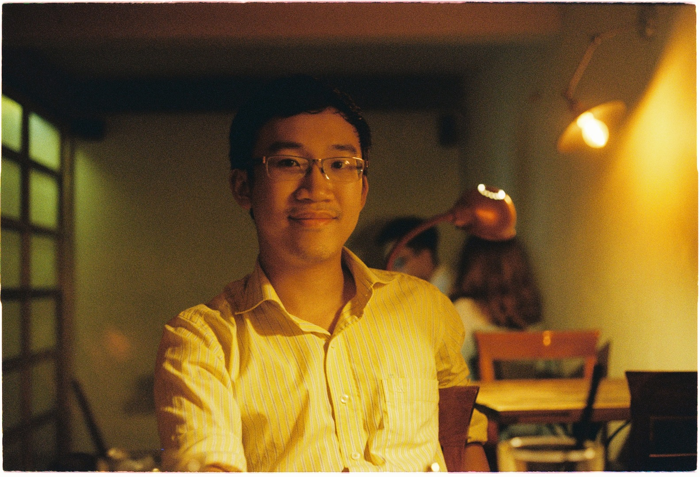

# My Personal Website/Blog thinggy

My name is Vu Lam, Dang. I'm a researcher (PhD candidate) for the Center for Bioinformatic, Saarland University under professor [Sven Rahmann](https://www.rahmannlab.de/people.html) supervision. We are currently looking for B.Sc and M.Sc students to do their thesis in our lab (see [proposal](Scientific%20Journey/proposal.md)). More topics [here](https://www.rahmannlab.de/lehre/thesistopics.html). We are also recruiting more PhD and Postdocs.

In 2021, I graduated from UGA's MoSIG program (Grenoble, France). My speciality including Software Engineering, Artificial Intelligence and Data Retrieval. For my Master project, I investigated the grouping of residues in protein sequence into *sectors* with a method called SCA (Statistical Coupling Analysis). I had also developed a model to simulate the statistical coupling of these residues, using Gibbs sampling.

For M1 internship I am working under Dr. Michael Blum's supervision to develop new method to calculate Polygenic Risk Score.

After graduating from the University of Science and Technology of Hanoi, I  worked on a bioinformatic project under supervision of Dr. Pierre Larmande at USTH's ICTLab, developing an engine to query from multiple genomics databases.

Beside working in informatics, I was the founder of a Fab Lab and Technology Club at USTH. Builder of several machines and design, I am well versed in (very informal) mechanical design and CAD/CAM. Favorite flavor of CAD: Fusion 360.
